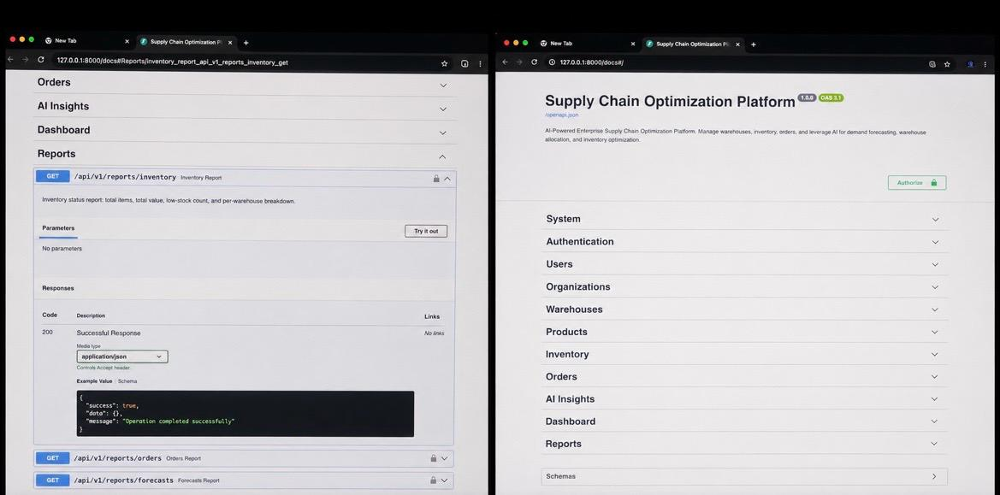
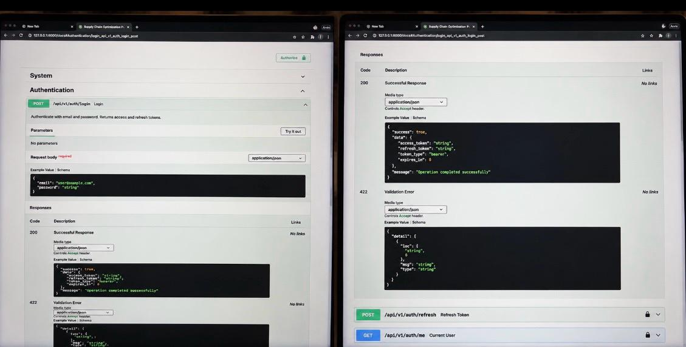
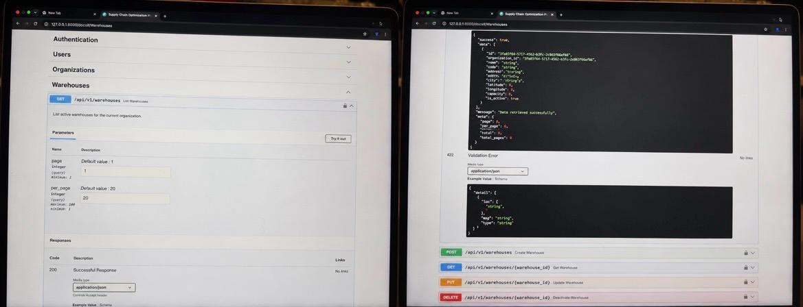
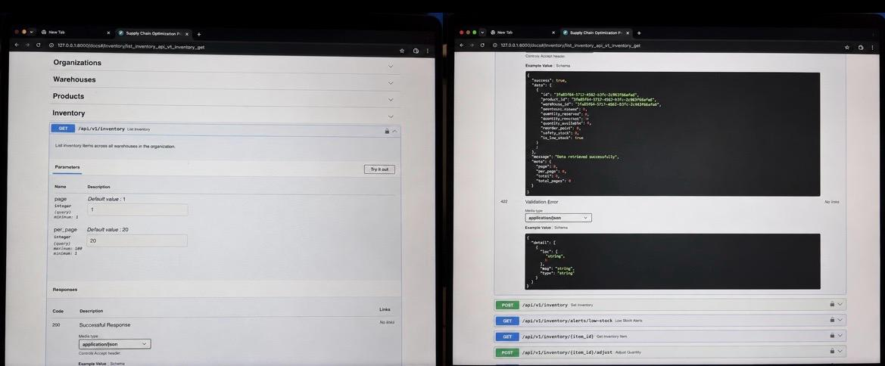
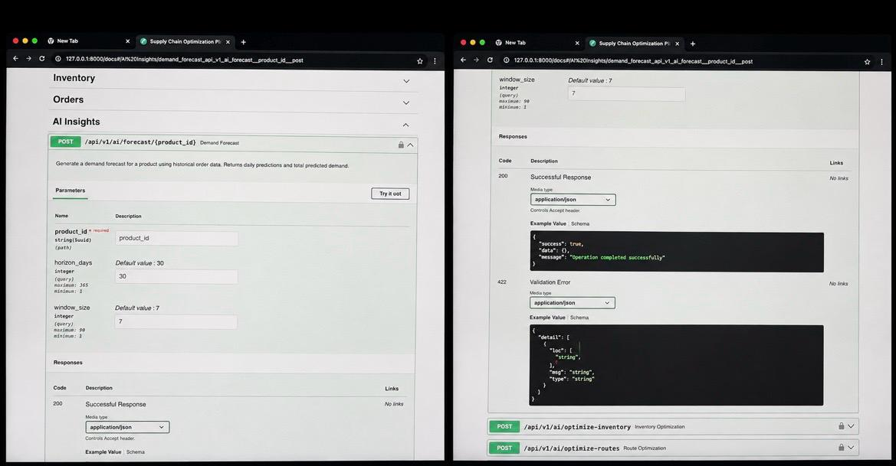
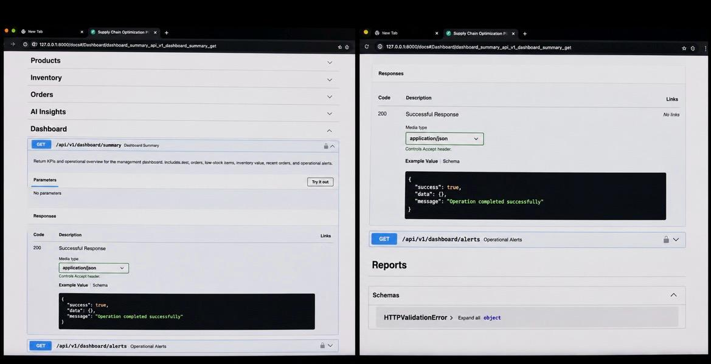

<p align="center">
  <h1 align="center">AI-Powered Supply Chain Optimization Platform</h1>
  <p align="center">Enterprise-grade platform for intelligent supply chain management, demand forecasting, and operational decision-making</p>
</p>

<p align="center">
  
  
  
  
  
  
</p>

<p align="center">
  
</p>

---

## Demo & API Walkthrough

The platform ships with a fully documented FastAPI backend — interactive Swagger UI available at `/docs`. All endpoints require JWT authentication, enforce role-based access control, and return a consistent JSON envelope. The API covers authentication, organization and warehouse management, inventory tracking, order lifecycle, AI insights (demand forecasting, inventory optimization, route optimization), the management dashboard, and reports.

**API Documentation Screenshots**

| | |
|:---:|:---:|
|  |  |
| *API Overview & Reports* | *Authentication Flow* |
|  |  |
| *Warehouses API* | *Inventory API* |
|  |  |
| *AI Insights API* | *Dashboard & Reports* |

---

## What Problem Does This Solve?

Organizations managing multiple warehouses, products, and orders lack reliable tools to make fast, intelligent operational decisions. They face:

- No unified inventory visibility across warehouses
- Slow, manual warehouse-to-order allocation decisions
- Unreliable demand forecasting leading to shortages or overstock
- No decision-support layer between raw data and management

This platform solves all of these with a clean, layered architecture and independent AI modules — each producing explainable recommendations.

---

## What the Platform Does

| Capability | Description |
|---|---|
| **Inventory Management** | Real-time stock tracking per product and warehouse |
| **Order Management** | Full order lifecycle: create, allocate, track, deliver |
| **Warehouse Allocation** | AI selects the best warehouse for each order based on stock, capacity, and proximity |
| **Demand Forecasting** | Moving-average baseline with pluggable interface for ML/DL models |
| **Inventory Optimization** | EOQ-based safety stock, reorder points, and cost estimation |
| **Route Optimization** | Nearest-neighbor routing with extensible VRP interface |
| **Management Dashboard** | KPIs, low-stock alerts, recent orders, AI insights |
| **Reports** | Operational and management reports |

Every AI decision includes an **explanation** — not just a result.

---

## Architecture

```
┌─────────────────────────────────────────────────────────────┐
│                     Frontend Dashboard                       │
│          (HTML5 / CSS3 / Vanilla JS — SPA-ready)            │
└──────────────────────────┬──────────────────────────────────┘
                           │ REST API  /api/v1/
┌──────────────────────────▼──────────────────────────────────┐
│                     FastAPI Backend                          │
│                                                              │
│  Routers ──► Services ──► Repositories ──► ORM Models       │
│                 │                                            │
│                 └──► AI Modules (independent, pluggable)     │
└──────────────────────────┬──────────────────────────────────┘
                           │
              ┌────────────┴────────────┐
              │                         │
     ┌────────▼────────┐     ┌──────────▼──────────┐
     │   PostgreSQL    │     │  Alembic Migrations  │
     │  (Primary DB)   │     │  (Schema versioning) │
     └─────────────────┘     └─────────────────────┘
```

**Layer responsibilities:**

| Layer | Responsibility |
|---|---|
| **Routers** | HTTP routing, request validation, response serialization — no business logic |
| **Services** | All business logic, domain rules, transaction orchestration |
| **Repositories** | All database queries — services never touch SQL directly |
| **Models** | SQLAlchemy ORM definitions — no behavior beyond computed properties |
| **AI Modules** | Pluggable algorithms; called by services, isolated from all other layers |

---

## AI Modules

Each AI module implements a defined interface, making algorithms **swappable without touching business logic:**

| Module | Interface | Implementation | Extensibility |
|---|---|---|---|
| Warehouse Allocation | `WarehouseAllocatorInterface` | Score-based: inventory × capacity × proximity | Replace with ML model |
| Demand Forecasting | `DemandForecasterInterface` | Moving average | Replace with ARIMA, Prophet, LSTM |
| Inventory Optimization | `InventoryOptimizerInterface` | EOQ + safety stock (z-score table) | Replace with stochastic models |
| Route Optimization | `RouteOptimizerInterface` | Nearest-neighbor algorithm | Replace with VRP solvers |

---

## User Roles

| Role | Access |
|---|---|
| `system_admin` | Full access across all organizations |
| `org_admin` | Full access within their organization |
| `warehouse_manager` | Warehouse and inventory management |
| `inventory_manager` | Inventory management and AI recommendations |
| `operations_manager` | Read orders, dashboard, reports |

The architecture supports per-role permission enforcement at both the API and service layer.

---

## Tech Stack

| Layer | Technology |
|---|---|
| Backend | Python 3.9+, FastAPI 0.104+ |
| Database | PostgreSQL 15+, SQLAlchemy 2.x, Alembic |
| Auth | JWT (python-jose), passlib/bcrypt |
| Validation | Pydantic v2 |
| Frontend | HTML5, CSS3, Vanilla JS (component-based) |
| Testing | pytest, httpx, SQLite in-memory |
| Containerization | Docker, Docker Compose |

---

## Quick Start

### Prerequisites

- Python 3.9+
- PostgreSQL 15+ (or Docker)

### Local Setup (without Docker)

```bash
# 1. Clone the repository
git clone https://github.com/azimilab2025-ai/IBM-Bob-Challenge-2026.git
cd IBM-Bob-Challenge-2026

# 2. Configure environment
cp .env.example .env
# Edit .env — set DATABASE_URL, SECRET_KEY, and admin credentials

# 3. Create virtual environment and install dependencies
cd backend
python3 -m venv .venv
source .venv/bin/activate          # Windows: .venv\Scripts\activate
pip install -r requirements.txt

# 4. Run database migrations
alembic upgrade head

# 5. Seed initial admin user and sample data
python ../scripts/seed_data.py

# 6. Start the API server
uvicorn app.main:app --reload --host 0.0.0.0 --port 8000
```

**Access:**
- API: `http://localhost:8000`
- Interactive Docs (Swagger): `http://localhost:8000/docs`
- ReDoc: `http://localhost:8000/redoc`
- Frontend: open `frontend/index.html` in a browser (or use any static file server)

### Docker Setup

```bash
# Start all services (PostgreSQL + Backend)
docker-compose up -d

# Run migrations
docker-compose exec backend alembic upgrade head

# Seed initial data
python scripts/seed_data.py

# Verify the API is running
curl http://localhost:8000/health
```

---

## Running Tests

```bash
cd backend
source .venv/bin/activate

# All tests (69 tests — unit + API)
pytest -v

# Unit tests only
pytest tests/unit/ -v

# API tests only
pytest tests/api/ -v

# With coverage
pytest --cov=app --cov=ai --cov-report=term-missing
```

**Test infrastructure:** In-memory SQLite is used for all tests — no running database required. The `UUIDType` TypeDecorator ensures identical behavior between SQLite and PostgreSQL.

---

## Project Structure

```text
IBM-Bob-Challenge-2026/
├── backend/
│   ├── app/
│   │   ├── api/v1/routers/
│   │   ├── core/
│   │   ├── db/
│   │   ├── models/
│   │   ├── schemas/
│   │   ├── repositories/
│   │   ├── services/
│   │   └── main.py
│   ├── ai/
│   ├── migrations/
│   ├── tests/
│   ├── Dockerfile
│   ├── requirements.txt
│   └── pytest.ini
├── frontend/
├── docs/
├── scripts/
├── docker-compose.yml
├── .env.example
└── README.md
```

---

## API Reference

| Method | Endpoint | Description |
|---|---|---|
| POST | `/api/v1/auth/login` | Authenticate and receive JWT tokens |
| POST | `/api/v1/auth/refresh` | Refresh access token |
| GET | `/api/v1/auth/me` | Current user profile |
| GET/POST | `/api/v1/organizations` | List or create organizations |
| GET/POST | `/api/v1/warehouses` | List or create warehouses |
| GET/POST | `/api/v1/products` | List or create products |
| GET/POST | `/api/v1/inventory` | List or set inventory |
| POST | `/api/v1/inventory/{id}/adjust` | Adjust stock quantity |
| GET | `/api/v1/inventory/alerts/low-stock` | Low-stock alerts |
| GET/POST | `/api/v1/orders` | List or create orders |
| POST | `/api/v1/orders/{id}/allocate` | AI warehouse allocation |
| POST | `/api/v1/ai/forecast/{product_id}` | Demand forecast |
| POST | `/api/v1/ai/optimize-inventory` | Inventory optimization |
| POST | `/api/v1/ai/optimize-routes` | Route optimization |
| GET | `/api/v1/dashboard/summary` | Management KPIs |
| GET | `/api/v1/reports/inventory` | Inventory report |

Full interactive documentation: `http://localhost:8000/docs`

---

## Documentation

| Document | Description |
|---|---|
| [Architecture](docs/architecture.md) | System design, layer responsibilities, data model |
| [API Reference](docs/api.md) | Endpoint contracts and examples |
| [AI Modules](docs/ai-modules.md) | Algorithm details and extensibility guide |
| [Development Guide](docs/development-guide.md) | Local setup and contribution workflow |
| [Deployment Guide](docs/deployment-guide.md) | Docker and cloud deployment |
| [Environment Variables](docs/environment-variables.md) | All configuration options |
| [Testing Guide](docs/testing-guide.md) | Test structure and how to run |
| [Roadmap](docs/roadmap.md) | v1 completion status and future milestones |

---

## v1.0 Status

- [x] Repository structure and Clean Architecture
- [x] Configuration, security, and dependency injection
- [x] Cross-dialect UUID type (PostgreSQL + SQLite)
- [x] 12-table database schema with Alembic migration
- [x] 9 SQLAlchemy ORM models
- [x] 9 Pydantic schema modules
- [x] 7 Repository classes (data access layer)
- [x] 9 Service classes (business logic layer)
- [x] 4 AI modules with abstract interfaces
- [x] 11 API routers (auth, users, orgs, warehouses, products, inventory, orders, AI, dashboard, reports, health)
- [x] Frontend dashboard (10 pages, complete CSS design system)
- [x] Test suite: 69 tests (22 unit + 47 API), 100% pass rate
- [x] Docker and Docker Compose configuration
- [x] Seed script and setup script
- [x] Complete documentation

---

## License

MIT License — see [LICENSE](LICENSE) for details.

---

<p align="center">Built with IBM Bob · IBM TechXChange Challenge 2026</p>